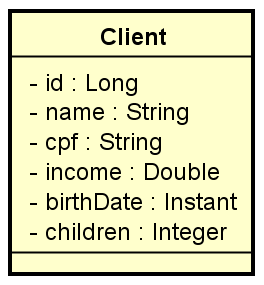

# Trabalho final do capítulo
## Enunciado do trabalho
Você deverá entregar um projeto Spring Boot 2.3.x contendo um CRUD completo de web
services REST para acessar um recurso de clientes, contendo as cinco operações básicas
aprendidas no capítulo:

* Busca paginada de recursos
* Busca de recurso por id
* Inserir novo recurso
* Atualizar recurso
* Deletar recurso

O projeto deverá estar com um ambiente de testes configurado acessando o banco de dados
H2, deverá usar Maven como gerenciador de dependência, Java 11 como linguagem.

Um cliente possui nome, CPF, renda, data de nascimento, e quantidade de filhos. A
especificação da entidade Client é mostrada a seguir (você deve seguir à risca os nomes de
classe e atributos mostrados no diagrama):



Seu projeto deverá fazer um seed de pelo menos 10 clientes com dados SIGNIFICATIVOS
(não é para usar dados sem significado como “Nome 1”, “Nome 2”, etc.).

## Como o trabalho será corrigido?
### 1. Importação do projeto
O professor deverá ser capaz de fazer um simples clone do projeto no Github, e importar e
executar o mesmo no STS sem necessidade de qualquer configuração especial diferente
daquelas das aulas.
### 2. Testes manuais no Postman
O professor já terá preparado em seu computador as requisições Postman abaixo. Todas elas
deverão funcionar corretamente:

Buscar paginada de clientes

```GET /clients?page=0&linesPerPage=12&direction=ASC&orderBy=name```

Buscar de cliente por id

```GET /clients/1```

Inserção de novo cliente

```POST /clients```
```javascript
{
  "name": "Maria Silva",
  "cpf": "12345678901",
  "income": 6500.0,
  "birthDate": "1994-07-20T10:30:00Z",
  "children": 2
}
```

Atualização de cliente

```PUT /clients/1```
```javascript
{
 "name": "Maria Silva",
 "cpf": "12345678901",
 "income": 6500.0,
 "birthDate": "1994-07-20T10:30:00Z",
 "children": 2
}
```

Deleção de cliente

```DELETE /clients/1```